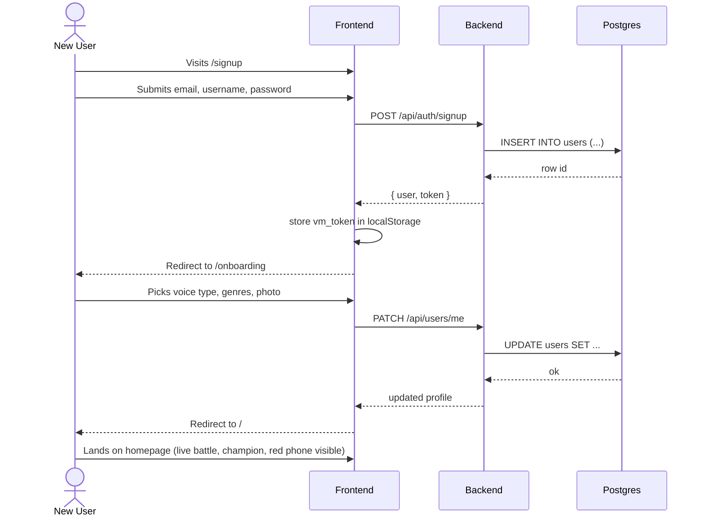
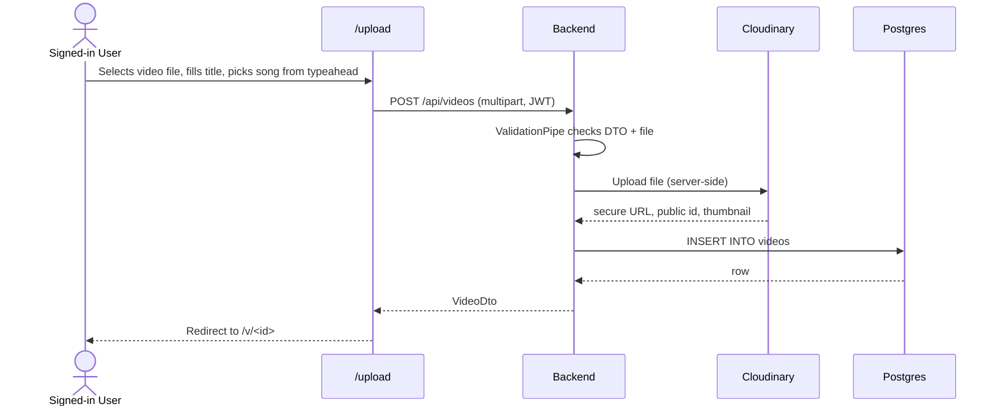
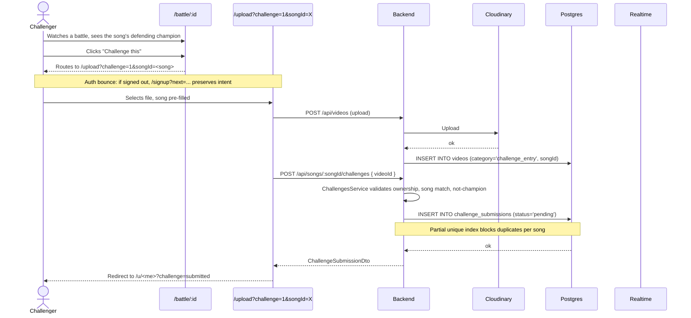
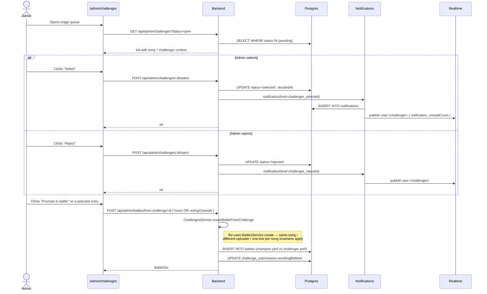
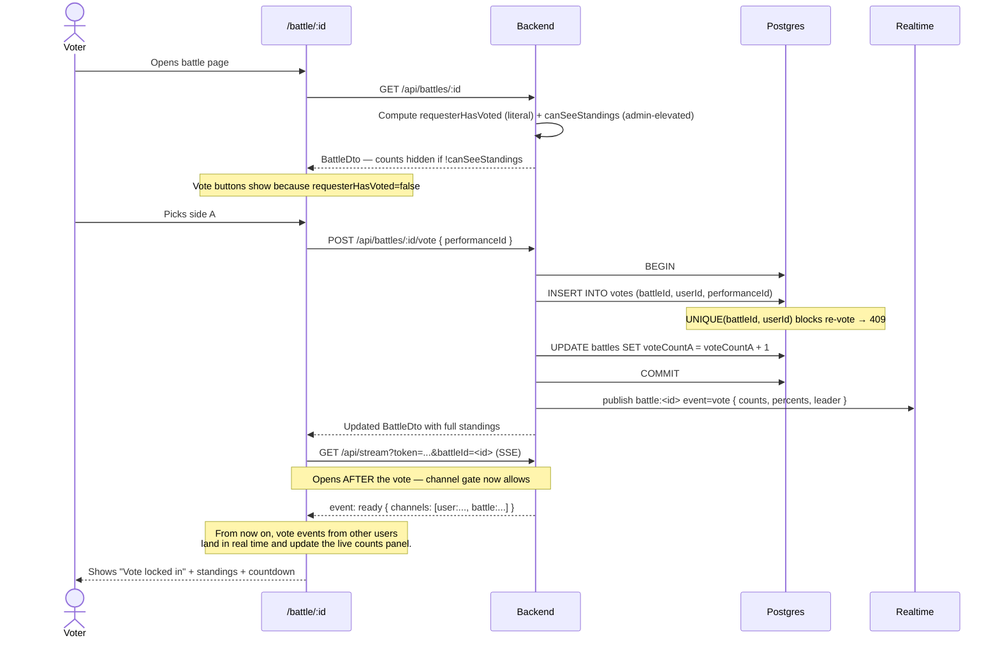
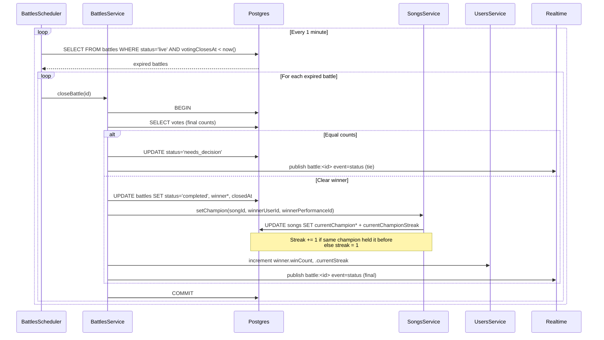
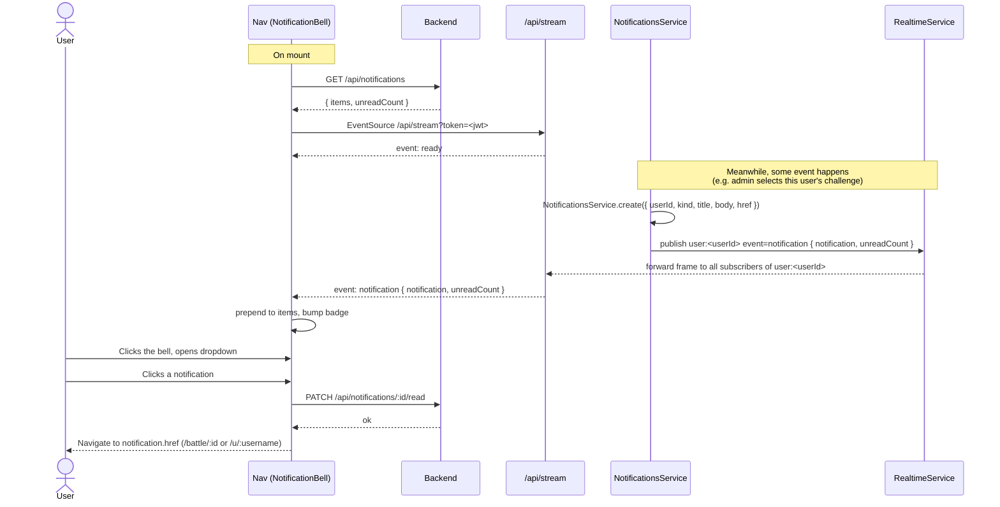
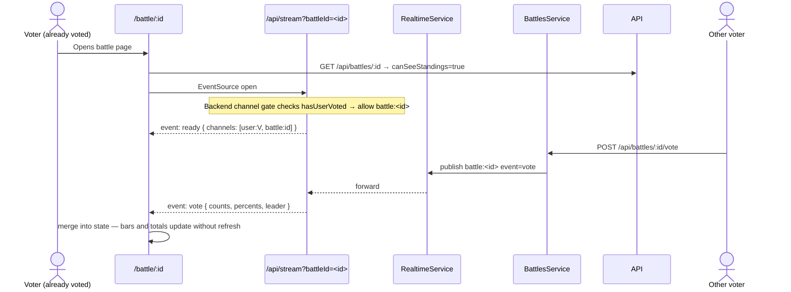

# VOCALMATCH — App Flow

Prepared: 2026-06-10
Scope: Phase 1 + Phase 2A + Phase 2B + Phase 3 (current shipped state)

End-to-end user journeys through the live system. Companion to `ERD.md` (schema), `TRD.md` (architecture), and `APP_FLOW_BY_ACTOR.md` (per-actor surface inventory).

---

## 1. The core loop

The prestige loop is the single most important flow in the product. Everything else is plumbing.

```
   Upload  ──▶  Battle  ──▶  Vote  ──▶  Crown  ──┐
                                                │
                       ┌────────────────────────┘
                       ▼
                   Challenge
                       │
                       └──▶  next Battle  ──▶  Vote  ──▶  Crown changes / extends
```

| Step | Actor | What happens |
|---|---|---|
| **Upload** | User | Records a video performance of a Centerstage Song; tags it. |
| **Battle** | Admin | Pairs two performances of the same song into a 1v1 with a voting window (default 48 h). |
| **Vote** | Audience | Casts one vote per battle. Counts hidden until they vote (anti-bandwagon). |
| **Crown** | Scheduler | At window close, higher count wins. Winner becomes "Official Voice" of that song. Streak +1 (same champion) or reset to 1 (new champion). |
| **Challenge** | Anyone (not the current champion) | Uploads a performance through the Red Phone for the song; admin triages. |
| **Repeat** | All | Promoted challenge → new battle pairing champion's performance vs challenger's. The crown is never safe. |

---

## 2. Signup + onboarding



**Notes:**
- Signup is open — no email verification step today.
- The "Finish your profile" nudge bar shows on homepage until `profileCompleted` flips to true.
- An admin who signs in is auto-redirected from `/` to `/admin` — the consumer homepage is for non-admin users.

---

## 3. Upload flow (standard performance)



**Constraints enforced:**
- File ≤ 100 MB, MIME `video/*`.
- Up to 10 tags, each ≤ 30 chars, leading `#` stripped.
- `songId` required to be eligible for any battle (`category: 'battle_entry' | 'challenge_entry'`).

---

## 4. Challenge submission flow (Red Phone)



**Failure modes:**
| Code | Cause |
|---|---|
| 403 | Performance doesn't belong to caller |
| 400 | Performance not tagged with this song |
| 409 | Caller is the current champion of this song |
| 409 | An active (`pending` or `selected`) challenge for this song already exists |

---

## 5. Admin Red Phone triage



---

## 6. Voting flow



**Failure modes:**
| Code | Cause |
|---|---|
| 409 | User already has a vote row for this battle |
| 400 | Battle status is not `live` (closed window, cancelled, etc.) |

**Anti-bandwagon gate:**
- `requesterHasVoted: boolean` — literal "did this user cast a vote?".
- `canSeeStandings: boolean` — server-elevated; true for admins and for completed/cancelled battles.
- Frontend uses the literal for vote-button visibility, the elevated for standings panel. Splitting them fixed the bug where admins on a fresh battle saw "Vote locked in" with no vote UI.

---

## 7. Battle close + crown assignment



**Worst-case drift:** ~60 s between actual `votingClosesAt` and finalization. Documented and acceptable.

**Tie path:**
- Battle moves to `needs_decision`.
- Admin opens `/admin/battles/:id`, picks a winner manually via `POST /api/battles/:id/resolve-tie { winnerPerformanceId }`.
- Audit field `tieResolvedByAdminId` records who resolved.

---

## 8. Notification flow (SSE)



**Reconnect behavior:**
- Browser `EventSource` auto-reconnects on network blip with exponential backoff.
- A REST `GET /api/notifications` on next mount or visibility-change re-syncs counts in case the SSE drifted.

---

## 9. Real-time vote counts on the battle page



**Channel gate:** the backend only attaches the caller to `battle:<id>` when they've already voted OR are admin. A not-yet-voter visiting the page sees the pre-vote screen and does NOT receive live counts.

---

## 10. Homepage flow (cinematic — Phase 3)

The homepage is the editorial surface that frames every other action. Top-to-bottom:

```
┌─────────────────────────────────────────────────────────┐
│  Hero: "One Song. Two Voices. One Crown."               │
│  Stats panel (votes / battles / challengers / voices)   │
│  Dual CTAs: Watch & Vote ▸  Take the Stage ▸            │
└─────────────────────────────────────────────────────────┘
                            │ scroll
                            ▼
┌─────────────────────────────────────────────────────────┐
│  Live Battle: A vs B with live countdown                │
│  → /battle/:id                                          │
└─────────────────────────────────────────────────────────┘
                            ▼
┌─────────────────────────────────────────────────────────┐
│  Crown at Risk: marquee + "FOR YOU" personalized        │
│  Personalized when caller is champion or voted side     │
└─────────────────────────────────────────────────────────┘
                            ▼
┌─────────────────────────────────────────────────────────┐
│  Red Phone: 4-step icon flow                            │
│  → /upload?challenge=1&songId=<song>                    │
└─────────────────────────────────────────────────────────┘
                            ▼
┌─────────────────────────────────────────────────────────┐
│  Defending Champion: portrait, badge, streak bar        │
│  → /u/<username>                                        │
└─────────────────────────────────────────────────────────┘
                            ▼
┌─────────────────────────────────────────────────────────┐
│  Dethroned panel + personalized "FOR YOU" variant       │
└─────────────────────────────────────────────────────────┘
                            ▼
┌─────────────────────────────────────────────────────────┐
│  How It Works: Song drops → Voices battle →             │
│  World votes → Red Phone opens                          │
└─────────────────────────────────────────────────────────┘
                            ▼
┌─────────────────────────────────────────────────────────┐
│  The Stage: searchable/filterable horizontal carousel   │
│  of performance cards                                   │
└─────────────────────────────────────────────────────────┘
                            ▼
┌─────────────────────────────────────────────────────────┐
│  Recent Winners: 3-card grid with win% progress bars    │
└─────────────────────────────────────────────────────────┘
                            ▼
┌─────────────────────────────────────────────────────────┐
│  Share Cards Row (new in Phase 3)                       │
└─────────────────────────────────────────────────────────┘
                            ▼
┌─────────────────────────────────────────────────────────┐
│  CTA Footer: "Win the song. Or get replaced."           │
│  Take the Stage  ▸  Watch Live Battle ▸                 │
└─────────────────────────────────────────────────────────┘
```

**Personalization:**
- Anonymous + non-stake users → marquee surfaces (highest at-risk song, headline dethronement).
- Signed-in user who is currently championing OR voted for the losing side of a recent dethronement → "FOR YOU" treatment with `.personal-stake` gold ring + crimson halo, links straight to their stake.

---

## 11. Admin flows

### Battle creation
```
/admin/battles → "New battle" → pick song → pick performance A → pick performance B
→ set duration → submit
→ POST /api/battles { songId, performanceAId, performanceBId, votingClosesAt }
→ status=live, channel battle:<id> opens
```

### Tie resolution
```
/admin/battles/:id (when status=needs_decision)
→ admin reviews → clicks winner side
→ POST /api/battles/:id/resolve-tie { winnerPerformanceId }
→ status=completed, champion updated, audit recorded
```

### Performance triage
```
/admin/performances → search / filter (missing song, soft-deleted)
→ assign song link  (PATCH /admin/performances/:id { songId })
→ or soft-delete    (DELETE /admin/performances/:id)
```

### User flag toggle
```
/admin/users → flip isAdmin / isSongwriter
→ PATCH /api/admin/users/:id/flags { isAdmin?, isSongwriter? }
```

---

## 12. State transitions summary

### Battle
```
[create] live ──(timer expires + clear winner)──▶ completed
              ──(timer expires + tie)──────────▶ needs_decision ──(admin resolves)──▶ completed
              ──(admin cancels)────────────────▶ cancelled
```

### Challenge submission
```
[user submits] pending ──(admin selects)──▶ selected ──(promote-to-battle)──▶ selected + resultingBattleId
                       ──(admin rejects)──▶ rejected
```

### Notification
```
[create] read=false ──(user clicks)──▶ read=true
                    ──(mark-all-read)──▶ read=true
```

### Champion (denormalized on songs)
```
After battle close:
  if winner.userId === song.currentChampionUserId:
      currentChampionStreak += 1
  else:
      currentChampionUserId = winner.userId
      currentChampionPerformanceId = winner.performanceId
      currentChampionStreak = 1
```

---

## 13. Error & edge-case map

| Flow | Edge case | Behavior |
|---|---|---|
| Vote | Battle window closed mid-click | 400 — frontend shows "Voting closed" |
| Vote | Re-vote attempt | 409 — frontend shows "You already voted" |
| Vote | Anonymous user | 401 — redirect to `/login?next=/battle/:id` |
| Challenge | Champion tries to challenge their own song | 409 |
| Challenge | Active queue entry already exists | 409 |
| Challenge | Performance from a different song | 400 |
| Upload | File > 100 MB | 400 from `MaxFileSizeValidator` |
| Upload | Non-video MIME | 400 from `FileTypeValidator` |
| Battle creation | Same uploader on both sides | 400 |
| Battle creation | Different songs on the two performances | 400 |
| Battle creation | One performance is soft-deleted | 400 |
| Profile read | Target is `privateProfile=true` and caller isn't the owner | 403 |
| Admin endpoint | Caller's JWT says isAdmin but DB row no longer admin | 401 from `AdminGuard` re-check |
| SSE | Caller's token expired mid-stream | Stream closes; client auto-reconnects with whatever's in localStorage; fails again if still expired |

---

## 14. Future flow additions (Phase 2C+)

1. **Email notifications** — `notification_deliveries` table, transactional email through a provider, opt-out preferences.
2. **Global leaderboards** — top performers across all songs, weekly / all-time, filterable.
3. **Songwriter portal** — `/songwriter/submit` → `song_submissions` queue → admin promotes to `songs`.
4. **Viral moments feed** — `prestige_moments` table, `/moment/:id` standalone pages, server-rendered share cards (Vercel OG).
5. **Follow / fan tribes** — `follows` table, "people you follow" feed, follow-notifications.
6. **Multi-variant share cards** — "I just challenged the official voice", "Vote now", "New official voice crowned", "The crown has been taken".
7. **Standalone `/about` cinematic page** — full mission philosophy surface.
