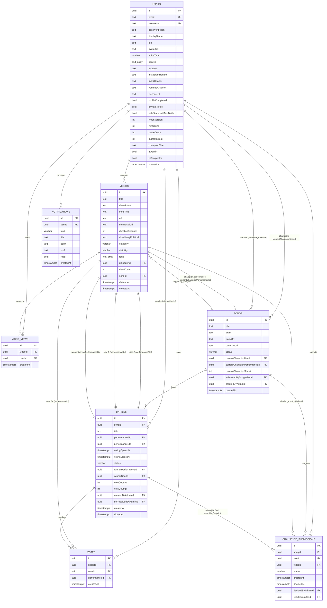

# VOCALMATCH — Entity Relationship Diagram (ERD)

Prepared: 2026-06-10
Scope: Phase 1 + Phase 2A + Phase 2B + Phase 3 personalization (current shipped state)

This document is the canonical reference for the VOCALMATCH database schema. Generated from the live TypeORM entities under `backend/src/**/*.entity.ts`.

---

## Diagram



---

## Table-by-table reference

### `users`

The platform identity. Stores auth credentials, profile, social links, and the denormalized prestige counters (`winCount`, `battleCount`, `currentStreak`).

| Column | Type | Notes |
|---|---|---|
| `id` | `uuid` PK | |
| `email` | `text` | Unique index. Normalized to lowercase on signup. |
| `username` | `text` | Unique index. `[a-zA-Z0-9_.-]`, min 3 chars. |
| `passwordHash` | `text` | bcrypt cost 10. |
| `displayName` / `bio` / `avatarUrl` | profile basics | All nullable. |
| `voiceType` | enum | `soprano` / `mezzo_soprano` / `alto` / `countertenor` / `tenor` / `baritone` / `bass` / `unsure`. |
| `genres` | text array | `simple-array` (comma-separated in the DB), max 8. |
| `location` | text | Free-form, 120 char cap. |
| `instagramHandle` / `tiktokHandle` / `youtubeChannel` / `websiteUrl` | text | Social links, all nullable. |
| `profileCompleted` | bool | Onboarding flag; gates the "Finish your profile" nudge. |
| `privateProfile` | bool | When true, only the owner can read the public profile endpoint. |
| `hideStatsUntilFirstBattle` | bool | Privacy: hide win/battle counters until first battle. |
| `tokenVersion` | int | Bumped by sign-out-everywhere / password change. Every JWT carries the version it was issued under and is rejected when stale. |
| `winCount` / `battleCount` / `currentStreak` | int | Denormalized prestige counters, updated on battle close. |
| `championTitle` | text | Optional honorific shown on profile + battle pages. |
| `isAdmin` | bool | Gates `AdminGuard`. |
| `isSongwriter` | bool | Reserved for Phase 2C song-submission flow; no functional gate today. |
| `createdAt` | timestamptz | |

### `songs` (Centerstage Songs)

Curated catalog. Each song is the "battleground" for a series of battles between performers covering it.

| Column | Type | Notes |
|---|---|---|
| `id` | `uuid` PK | |
| `title` | text | Indexed. |
| `artist` | text | |
| `trackUrl` / `coverArtUrl` | text | Nullable; reference track + art. |
| `status` | enum | `active` / `retired`. Indexed. Retired songs stay readable but don't accept new battles. |
| `currentChampionUserId` | uuid | Denormalized — written on battle close. Source of truth for "who holds this song's crown." |
| `currentChampionPerformanceId` | uuid | The winning video; pre-fills side A on the next challenge battle. |
| `currentChampionStreak` | int | Increments on same-champion wins, resets to 1 on a new champion. |
| `submittedBySongwriterId` | uuid | Phase 2C — songwriter who proposed the song. NULL for admin-created. |
| `createdByAdminId` | uuid | Audit. |
| `createdAt` | timestamptz | |

### `videos` (performances)

User-uploaded video performances. Stored on Cloudinary; the row carries the URL, thumbnail, duration, and metadata.

| Column | Type | Notes |
|---|---|---|
| `id` | `uuid` PK | |
| `title` | text | 1–120 chars. |
| `description` | text | Nullable, ≤1000 chars. |
| `songTitle` | text | Free-form; indexed for search. |
| `url` | text | Cloudinary secure URL. |
| `thumbnailUrl` | text | Cloudinary-derived. |
| `durationSeconds` | int | |
| `cloudinaryPublicId` | text | Needed to delete from Cloudinary on hard-delete. |
| `category` | enum | `solo` (default) / `battle_entry` / `challenge_entry`. Indexed. |
| `visibility` | enum | `public` / `unlisted` / `private`. Indexed. |
| `tags` | text array | Comma-separated; max 10, each ≤ 30 chars. |
| `uploaderId` | uuid FK → `users.id` | Cascade-delete from the user. Indexed. |
| `viewCount` | int | Maintained at write time; see `video_views`. |
| `songId` | uuid FK → `songs.id` | Indexed. Required for battle eligibility. |
| `deletedAt` | timestamptz | Soft-delete marker. Indexed. Once set, video disappears from feed/profile; battle history stays intact. |
| `createdAt` | timestamptz | |

### `video_views`

One row per `(videoId, userId)` pair. Enforces "count each signed-in user once" via a unique constraint.

| Column | Type | Notes |
|---|---|---|
| `id` | `uuid` PK | |
| `videoId` | uuid FK | Indexed. |
| `userId` | uuid FK | Indexed. |
| `createdAt` | timestamptz | |

**Unique constraint:** `(videoId, userId)`. `VideosService.recordView()` attempts the insert and catches the unique-violation; only the first insert bumps `videos.viewCount`.

Anonymous views are not recorded.

### `battles`

A 1v1 battle between two performances of the same song.

| Column | Type | Notes |
|---|---|---|
| `id` | `uuid` PK | |
| `songId` | uuid FK | Indexed. |
| `title` | text | Optional; admin override. |
| `performanceAId` / `performanceBId` | uuid FK → `videos.id` | Different uploaders, same song. |
| `votingOpensAt` / `votingClosesAt` | timestamptz | `votingClosesAt` indexed for the scheduler poll. |
| `status` | enum | Indexed. State machine below. |
| `winnerPerformanceId` / `winnerUserId` | uuid | Set on close. |
| `voteCountA` / `voteCountB` | int | Denormalized; authoritative source is `votes`. Maintained inside the vote transaction. |
| `createdByAdminId` / `tieResolvedByAdminId` | uuid FK | Audit. |
| `createdAt` / `closedAt` | timestamptz | |

**State machine:**

```
live ──(timer expires, clear winner)──▶ completed
live ──(timer expires, tie)─────────▶ needs_decision ──(admin resolves)──▶ completed
live ──(admin cancels)──────────────▶ cancelled
```

**Partial unique index — one live battle per song:**
```sql
CREATE UNIQUE INDEX one_live_battle_per_song
  ON battles (songId)
  WHERE status = 'live';
```

### `votes`

One vote per `(battleId, userId)` pair.

| Column | Type | Notes |
|---|---|---|
| `id` | `uuid` PK | |
| `battleId` | uuid FK | Indexed. |
| `userId` | uuid FK | Indexed. |
| `performanceId` | uuid FK | Must equal `performanceAId` or `performanceBId` of the battle. |
| `createdAt` | timestamptz | |

**Unique constraint:** `(battleId, userId)`. Re-vote attempts return HTTP 409 by catching the DB violation.

### `challenge_submissions` (Red Phone queue)

Performances submitted as challenges against the current champion of a song. Admin triages.

| Column | Type | Notes |
|---|---|---|
| `id` | `uuid` PK | |
| `songId` | uuid FK | Indexed. |
| `userId` | uuid FK | Indexed. The challenger. |
| `videoId` | uuid FK → `videos.id` | Indexed. The performance being submitted. |
| `status` | enum | `pending` / `selected` / `rejected`. Indexed. |
| `createdAt` | timestamptz | |
| `decidedAt` | timestamptz | NULL while pending. |
| `decidedByAdminId` | uuid FK | Audit. |
| `resultingBattleId` | uuid FK → `battles.id` | Set when admin promotes a selected entry into a live battle. |

**Lifecycle:**
```
pending ──(admin selects)──▶ selected ──(battle created)──▶ used (status stays 'selected')
pending ──(admin rejects)──▶ rejected
```

**Partial unique index — one active challenge per song:**
```sql
CREATE UNIQUE INDEX one_active_challenger_per_song
  ON challenge_submissions (songId)
  WHERE status IN ('pending', 'selected');
```

### `notifications`

In-app notification feed. Streamed live via SSE; persisted for the bell dropdown history.

| Column | Type | Notes |
|---|---|---|
| `id` | `uuid` PK | |
| `userId` | uuid FK | Indexed. |
| `kind` | enum | `challenger_selected` / `challenger_rejected` / `battle_starting` / `battle_result` (reserved) / `system`. |
| `title` / `body` | text | What the bell dropdown renders. |
| `href` | text | Deep-link path (e.g. `/battle/<id>` or `/u/<username>`). |
| `read` | bool | Indexed. |
| `createdAt` | timestamptz | |

**No email delivery** — Phase 2C concern.

---

## Cross-cutting invariants

These constraints span multiple tables and are enforced at the application layer (some also via DB partial indexes where Postgres supports them):

1. **One live battle per song** — enforced by `one_live_battle_per_song` partial unique index.
2. **One active challenge per song** — enforced by `one_active_challenger_per_song` partial unique index.
3. **One vote per user per battle** — enforced by `UQ_votes_battle_user` unique constraint.
4. **Battle pairing rules** — same song, different uploaders. Enforced in `BattlesService.create()`.
5. **Champion can't self-challenge** — `ChallengesService.createSubmission()` returns 409 when `userId === song.currentChampionUserId`.
6. **Soft-delete protection for battle-participated videos** — `VideosService.delete()` blocks hard-delete when the video has a row in `votes` or appears as `performanceAId` / `performanceBId` on any battle. Admin can override via `DELETE /admin/performances/:id`.
7. **One unique-view row per signed-in viewer** — enforced by `UQ_video_views_video_user`.

---

## Index summary

| Table | Index | Purpose |
|---|---|---|
| `users` | unique `email` | Login lookup. |
| `users` | unique `username` | Username collision check. |
| `videos` | `uploaderId`, `songId`, `category`, `visibility`, `songTitle`, `deletedAt` | Feed filters + admin triage. |
| `video_views` | unique `(videoId, userId)` | Dedupe + count. |
| `songs` | `title`, `status` | Catalog browse + filter. |
| `battles` | `songId`, `status`, `votingClosesAt` | Scheduler + listing. |
| `battles` | partial unique on `songId WHERE status='live'` | One live battle per song. |
| `votes` | unique `(battleId, userId)` | Vote-finality enforcement. |
| `votes` | `battleId`, `userId` | Per-battle and per-user lookups. |
| `challenge_submissions` | `songId`, `userId`, `videoId`, `status` | Queue + per-user listing. |
| `challenge_submissions` | partial unique on `songId WHERE status IN ('pending','selected')` | One active challenge per song. |
| `notifications` | `userId`, `read` | Bell badge unread count. |

---

## Forward-looking notes

These additions are planned and reserved in code/comments but not yet shipped:

- **`song_submissions`** (Phase 2C) — songwriter-proposed songs queue. The `users.isSongwriter` flag exists today as the role anchor.
- **`prestige_moments`** (Phase 3.5) — classified moments (dethronement, close finish, upset, streak milestone, surge) for the Viral Moments feed. The dethronement detection from M4 is the foundation that feeds this table when it lands.
- **Email delivery** (Phase 2C) — adds a `notification_deliveries` table or extends `notifications` with delivery-status fields.
